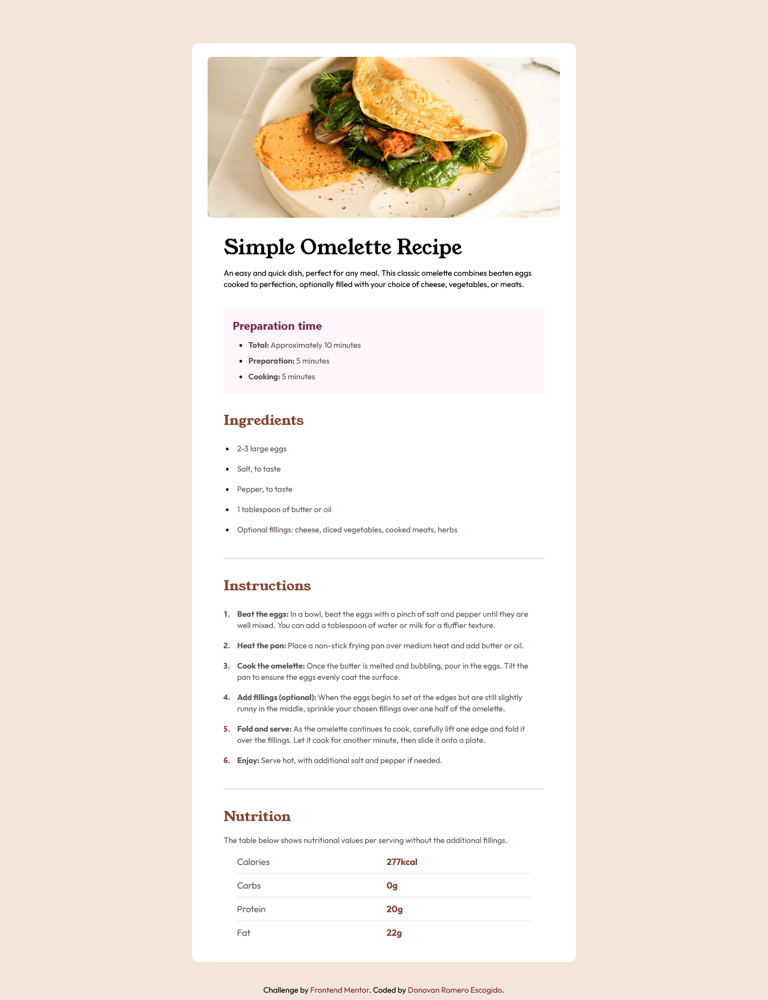

# Frontend Mentor - Recipe page solution

This is a solution to the [Recipe page challenge on Frontend Mentor](https://www.frontendmentor.io/challenges/recipe-page-KiTsR8QQKm). Frontend Mentor challenges help you improve your coding skills by building realistic projects. 

## Table of contents

  - [The challenge](#the-challenge)
  - [Screenshot](#screenshot)
  - [Links](#links)
- [My process](#my-process)
  - [Built with](#built-with)
  - [What I learned](#what-i-learned)
  - [Continued development](#continued-development)
  - [Useful resources](#useful-resources)
- [Author](#author)
- [Acknowledgments](#acknowledgments)

### Screenshot

### Links

- Solution URL: [https://github.com/nsvonod12/recipe-page]
- Live Site URL: [https://nsvonod12.github.io/recipe-page/src/index.html]()

## My process
It was fantastic, I really enjoyed it and I learned how to use Tailwind CSS better.

### Built with

- Semantic HTML5 markup
- Flexbox
- CSS Grid
- Mobile-first workflow
- Tailwind CSS
- NPM

### What I learned
I've already used Tailwinds CSS in other projects and I really like it. It's very easy to use and customizable.

### Continued development
I think that Animations will be the next step to make better projects.

### Useful resources

- [Tailwind CSS](https://tailwindcss.com/docs/installation) - This helped me for documentation in TailwindCSS.

## Author

- Website - [Donovan Romero Escogido](https://github.com/nsvonod12)
- Frontend Mentor - [@nsvonod12](https://www.frontendmentor.io/profile/nsvonod12)
